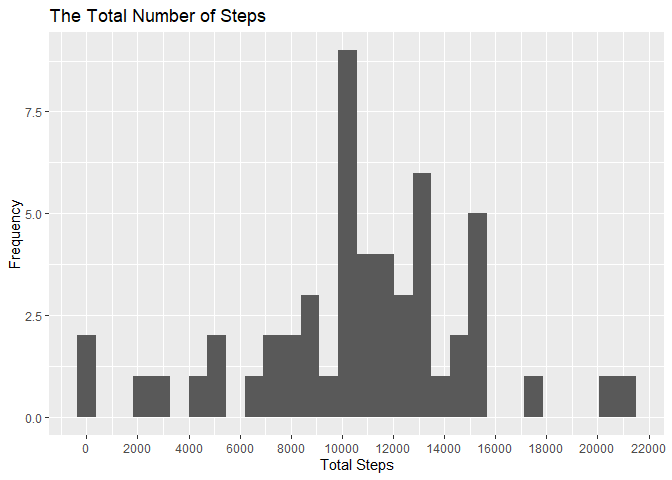
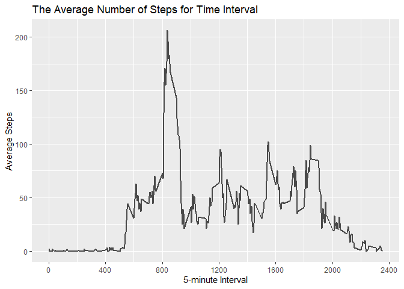
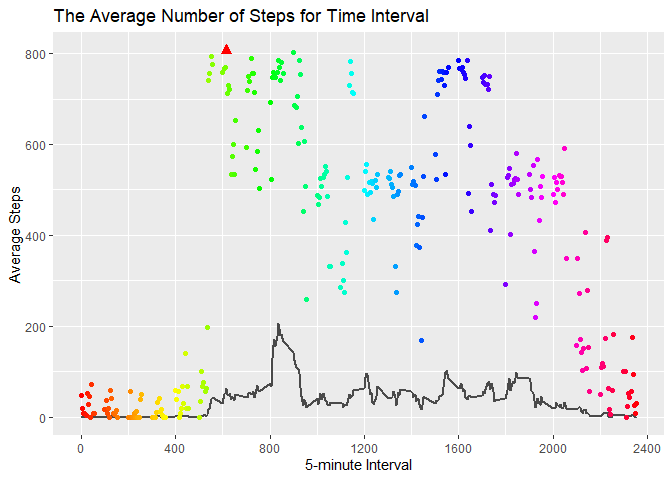
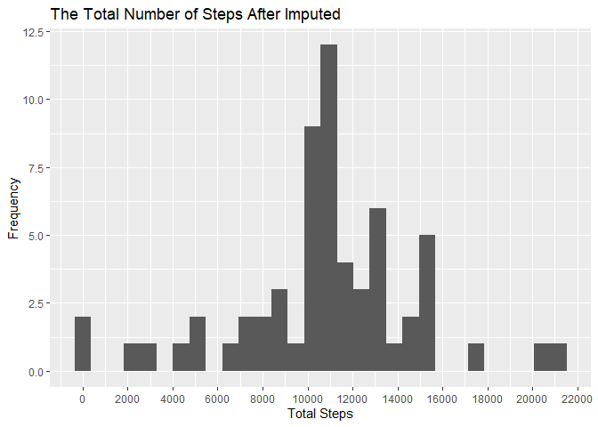
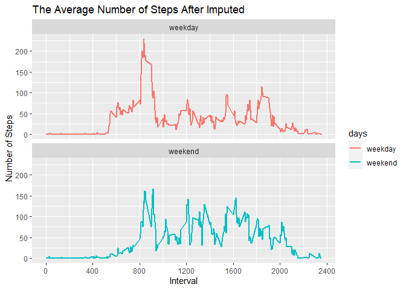

## Loading and preprocessing the data

```r
## Loading packages
library(dplyr)
library(ggplot2)
library(lubridate)
## download from the link provided if not exists
zipfile <- "repdata_data_activity.zip"
if (!file.exists(zipfile)) {
    file_url <-
        "https://d396qusza40orc.cloudfront.net/repdata%2Fdata%2Factivity.zip"
    download.file(file_url, zipfile, method = "curl")
    
}
## unzip file if not unzipped
if (!file.exists("activity.csv")) {
    print("unzipping file")
    unzip(zipfile)
}

## Reading the dataset and processing the data
df.act <- read.csv("activity.csv")
df.act$date <- as.Date(df.act$date, format = "%Y-%m-%d")
```

## What is mean total number of steps taken per day?

For this part of the assignment, you can ignore the missing values in the dataset.

1. Calculate the total number of steps taken per day.  
2. Make a histogram of the total number of steps taken each day.  
3. Calculate and report the mean and median of the total number of steps taken per day. 


```r
## 1. Calculate the total number of steps taken per day.
by_date <- group_by(df.act, date)
df.sumSteps <- summarize(by_date, sumSteps = sum(steps))

## 2. Histogram of the total number of steps taken each day
g <- ggplot (data = df.sumSteps, aes(x = sumSteps)) +
    geom_histogram() +
    scale_x_continuous(breaks = seq(-2000, 22000, by = 2000)) +
    ggtitle("The Total Number of Steps") +
    labs(x = "Total Steps", y = "Frequency")
print(g)
```

<!-- -->

```r
## 3. Mean and median number of steps taken each day
meanValue <- round(mean(df.sumSteps$sumSteps, na.rm = TRUE))
medianValue <- round(median(df.sumSteps$sumSteps, na.rm = TRUE))
cat ("The mean and median of the total number of steps taken per day are: ",
    "\n", 
    "  Mean steps: ",
    meanValue,
    "\n",
    "  Median Steps: ",
    medianValue,
    "\n",
    sep = ""
)
```

```
## The mean and median of the total number of steps taken per day are: 
##   Mean steps: 10766
##   Median Steps: 10765
```


## What is the average daily activity pattern?

#### 1. Make a time series plot (i.e. <span style="color:red">type = "l"</span>) of the 5-minute interval (x-axis) and the average number of steps taken, averaged across all days (y-axis)

```r
## 4. Time series plot of the average number of steps taken
by_interval <- group_by(df.act, interval)
df.meanIntervalSteps <-
    summarize(by_interval, meanSteps = round(mean(steps, na.rm = T)))
g <-
    ggplot (data = df.meanIntervalSteps, aes(x = interval, y = meanSteps)) +
    geom_line(colour = "grey29", size = 1) +
    scale_x_continuous(breaks = seq(-400, 2800, by = 400)) +
    ggtitle("The Average Number of Steps for Time Interval") +
    labs(x = "5-minute Interval", y = "Average Steps")

print(g)
```

<!-- -->


#### 2. Which 5-minute interval, on average across all the days in the dataset, contains the maximum number of steps?  


```r
## 5. The 5-minute interval that, on average, contains the maximum number of steps
df.maxIntervalSteps <-
    summarize(by_interval, maxSteps = max(steps, na.rm = T))
top1_subset = top_n(df.maxIntervalSteps, 1, maxSteps)
cat ("Interval ", 
     top1_subset$interval,
     " contains the maximum number of steps ", 
     top1_subset$maxSteps, 
     sep = "")
```

```
## Interval 615 contains the maximum number of steps 806
```

Based on previous time series plot, We plot all the maximum number of steps of each 5-minute interval with rainbow points, and especially show the maximum number steps with <span style="color:red">red triangle</span>.


```r
g <- g +
    geom_point(data = df.maxIntervalSteps,
               aes(x = interval, y = maxSteps),
               colour = rainbow(288)) +
    geom_point(
        data = top1_subset,
        aes(x = interval, y = maxSteps),
        colour = "red",
        size = 3,
        pch = 17
    )

print(g)
```

<!-- -->


## Imputing missing values

There are a number of days/intervals where there are missing values (coded as **NA**). The presence of missing days may introduce bias into some calculations or summaries of the data.

#### 1. Calculate and report the total number of missing values in the dataset (i.e. the total number of rows with **NA**s)  

```r
cntNa <- sum(is.na(df.act$steps))
cat ("The total number of missing values is ", cntNa, sep = "")
```

```
## The total number of missing values is 2304
```

#### 2. Filling the missing values and creating a new dataset based on the original dataset
2. Devise a strategy for filling in all of the missing values in the dataset. The strategy does not need to be sophisticated. For example, you could use the mean/median for that day, or the mean for that 5-minute interval, etc.  
3. Create a new dataset that is equal to the original dataset but with the missing data filled in.


```r
## Create a new dataset with the original dataset
df.actNew <- df.act
## Filling in the missing value with the mean for that 5-minute interval
for (i in 1:nrow(df.actNew)) {
    if (is.na(df.actNew$steps[i])) {
        df.actNew$steps[i] <-
            subset(df.meanIntervalSteps, interval == df.actNew$interval[i])$meanSteps
    }
}
```

#### Make a histogram of the total number of steps taken each day and report 
4. Make a histogram of the total number of steps taken each day and Calculate and report the mean and median total number of steps taken per day. 

```r
## Summarising the total number of steps taken each day
by_dateNew <- group_by(df.actNew, date)
df.sumStepsNew <- summarize(by_dateNew, sumSteps = sum(steps))

## Make a histogram
g <- ggplot (data = df.sumStepsNew, aes(x = sumSteps)) +
    geom_histogram() +
    scale_x_continuous(breaks = seq(-2000, 22000, by = 2000)) +
    ggtitle("The Total Number of Steps After Imputed") +
    labs(x = "Total Steps", y = "Frequency")
print(g)
```

<!-- -->

#### Report the mean and median total number of steps taken per day
Do these values differ from the estimates from the first part of the assignment? What is the impact of imputing missing data on the estimates of the total daily number of steps?   

From the print result, we can see the mean value is same, but there are a little bit difference for median value. 


```r
## 3. Mean and median number of steps taken each day
meanValueNew <- round(mean(df.sumStepsNew$sumSteps, na.rm = TRUE))
medianValueNew <- round(median(df.sumStepsNew$sumSteps, na.rm = TRUE))
cat ("The mean and median of the total number of steps taken per day are: ",
     "\n", "  Previous mean steps: ", meanValue,  
     ", New mean steps: ", meanValueNew, 
     "\n", "  Previous median Steps: ", medianValue, 
     ", New median Steps: ", medianValueNew, 
     "\n", sep = "")
```

```
## The mean and median of the total number of steps taken per day are: 
##   Previous mean steps: 10766, New mean steps: 10766
##   Previous median Steps: 10765, New median Steps: 10762
```

While imputing the missing data, we use mean value of 5-minute interval. What about we use the use the mean and median for that day, let's try median value. From the results, we can see these values are different from the provious ones.


```r
## Create a new dataset with the original dataset
df.meanMedianDate <-
    summarize(by_date,
              meanSteps = round(mean(steps, na.rm = T)),
              medianSteps = round(median(steps, na.rm =
                                             T)))
## Replace 0 for NA mean or NA median values
df.meanMedianDate$meanSteps[is.na(df.meanMedianDate$meanSteps)] <- 0
df.meanMedianDate$medianSteps[is.na(df.meanMedianDate$medianSteps)] <- 0

df.actNew2 <- df.act
## Filling in the missing value with the mean for that 5-minute interval
for (i in 1:nrow(df.actNew2)) {
    if (is.na(df.actNew2$steps[i])) {
        df.actNew2$steps[i] <-
            subset(df.meanMedianDate, date == df.actNew2$date[i])$medianSteps
        # df.actNew2$steps[i] <- subset(df.meanMedianDate, date==df.actNew2$date[i])$meanSteps
        
    }
}
## Summarising the total number of steps taken each day
by_dateNew2 <- group_by(df.actNew2, date)
df.sumStepsNew2 <- summarize(by_dateNew2, sumSteps = sum(steps))

## Mean and median number of steps taken each day
meanValueNew2 <- round(mean(df.sumStepsNew2$sumSteps, na.rm = TRUE))
medianValueNew2 <-
    round(median(df.sumStepsNew2$sumSteps, na.rm = TRUE))
cat (
    "The mean and median of the total number of steps taken per day are: ",
    "\n",
    "  Previous mean steps: ",
    meanValue,
    ", New mean steps: ",
    meanValueNew2,
    "\n",
    "  Previous median Steps: ",
    medianValue,
    ", New median Steps: ",
    medianValueNew2,
    "\n",
    sep = ""
)
```

```
## The mean and median of the total number of steps taken per day are: 
##   Previous mean steps: 10766, New mean steps: 9354
##   Previous median Steps: 10765, New median Steps: 10395
```

## Are there differences in activity patterns between weekdays and weekends?

1. Create a new factor variable in the dataset with two levels – “weekday” and “weekend” indicating whether a given date is a weekday or weekend day.  
2. Make a panel plot containing a time series plot (i.e. <span style="color:red">type = "l"</span> ) of the 5-minute interval (x-axis) and the average number of steps taken, averaged across all weekday days or weekend days (y-axis). See the README file in the GitHub repository to see an example of what this plot should look like using simulated data.


```r
## Adding a new factor column in the imputed data set with two levels – “weekday” and “weekend”
df.actNew <- mutate(df.actNew,
                    days = factor(case_when(
                        wday(date) == 1 | wday(date) == 7 ~ "weekend",
                        TRUE ~ "weekday"
                    )))

## Summarising data
by_intervalNew <- group_by(df.actNew, interval, days)
df.meanIntervalSteps2 <-
    summarize(by_intervalNew, meanSteps = round(mean(steps, na.rm = T)))

g <-
    ggplot(df.meanIntervalSteps2, aes(interval, meanSteps, colour = days)) + 
    geom_line(size = 1) +
    facet_wrap(. ~ days, ncol = 1) +
    scale_x_continuous(breaks = seq(-400, 2800, by = 400)) +
    ggtitle("The Average Number of Steps After Imputed") +
    labs(x = "Interval", y = "Number of Steps")
print(g)
```

<!-- -->

